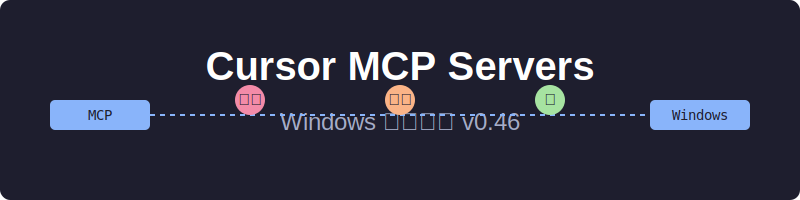
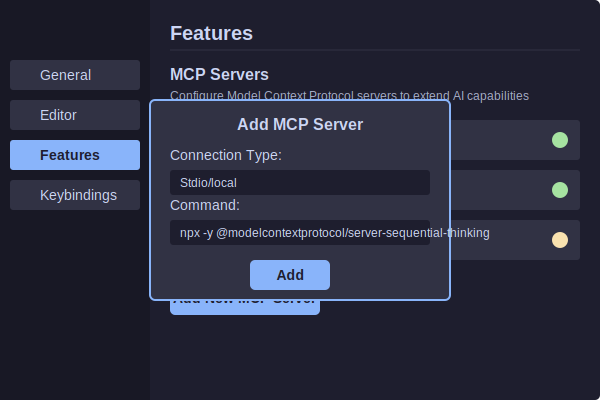

# Cursor MCP Servers 0.46 Windows 配置指南



## 简介

本仓库提供了在Windows环境下配置和使用Cursor IDE 0.46版本中的MCP (Model Context Protocol) Servers功能的详细指南。MCP允许AI助手使用外部工具和服务，极大地扩展了其功能和实用性。

### 什么是MCP?

MCP (Model Context Protocol) 是一种允许大型语言模型(LLM)与外部工具和服务交互的协议。在Cursor IDE中，MCP Servers功能允许AI助手调用各种工具来执行搜索、浏览网页、执行代码等操作。

## 目录

- [前提条件](#前提条件)
- [安装方法](#安装方法)
  - [方法1: 通过Cursor设置界面](#方法1-通过cursor设置界面)
  - [方法2: 使用项目级配置文件](#方法2-使用项目级配置文件)
  - [方法3: 使用全局配置文件](#方法3-使用全局配置文件)
- [常用MCP服务器](#常用mcp服务器)
- [环境变量配置](#环境变量配置)
- [故障排除](#故障排除)
- [最佳实践](#最佳实践)
- [常见问题](#常见问题)
- [参考资源](#参考资源)

## 前提条件

在开始配置MCP Servers之前，请确保满足以下条件：

- Cursor IDE 0.46或更高版本
- Windows 10/11操作系统
- Node.js v18或更高版本
- 基本的命令行知识
- 特定MCP服务器可能需要的API密钥

## 安装方法

### 方法1: 通过Cursor设置界面

这是最简单的方法，适合初学者：

1. 打开Cursor IDE
2. 点击左下角的设置图标(⚙️)
3. 导航至"Features"部分
4. 滚动到"MCP Servers"部分
5. 点击"Add New MCP Server"
6. 选择"Stdio/local"作为连接类型
7. 输入服务器命令（见[常用MCP服务器](#常用mcp服务器)部分）
8. 点击"Add"保存配置



### 方法2: 使用项目级配置文件

> **注意**: 在Windows环境中，项目级配置文件功能在Cursor 0.46版本可能存在问题。如果此方法不起作用，请使用方法1或方法3。

为特定项目配置MCP服务器：

1. 在项目根目录创建`.cursor`文件夹（如果不存在）
2. 在`.cursor`文件夹中创建`mcp.json`文件
3. 使用以下格式配置MCP服务器：

```json
{
  "mcpServers": {
    "server_name": {
      "command": "command_executable",
      "args": ["arg1", "arg2", "..."]
    }
  }
}
```

例如，配置Sequential Thinking服务器：

```json
{
  "mcpServers": {
    "sequential_thinking": {
      "command": "npx",
      "args": ["-y", "@modelcontextprotocol/server-sequential-thinking"]
    }
  }
}
```

### 方法3: 使用全局配置文件

> **注意**: 全局配置文件功能可能需要特定版本的Cursor才能支持。

为所有项目配置MCP服务器：

1. 导航到Cursor的配置目录（通常在`%APPDATA%\Cursor`）
2. 创建或编辑`mcp.json`文件
3. 使用与项目级配置相同的格式

## 常用MCP服务器

以下是一些常用的MCP服务器及其配置命令：

### Sequential Thinking
```
npx -y @modelcontextprotocol/server-sequential-thinking
```

### Brave Search
```
env BRAVE_API_KEY=[your-key] npx -y @modelcontextprotocol/server-brave-search
```

### Puppeteer (网页浏览)
```
npx -y @modelcontextprotocol/server-puppeteer
```

### GitHub工具
```
npx -y @modelcontextprotocol/server-github
```

### 文件系统工具
```
npx -y @modelcontextprotocol/server-fs
```

## 环境变量配置

某些MCP服务器需要环境变量来配置API密钥或其他设置。在Windows中，有几种方法可以设置环境变量：

### 方法1: 在命令中直接设置

```
env API_KEY=your_key_here npx -y @package/server-name
```

### 方法2: 使用PowerShell设置临时环境变量

```powershell
$env:API_KEY="your_key_here"
npx -y @package/server-name
```

### 方法3: 使用系统环境变量

1. 右键点击"此电脑"，选择"属性"
2. 点击"高级系统设置"
3. 点击"环境变量"
4. 在"用户变量"部分添加新变量

## 故障排除

### 常见问题及解决方案

1. **MCP服务器状态显示为黄色**
   - 尝试刷新服务器状态
   - 检查命令是否正确
   - 重启Cursor IDE

2. **无法找到MCP工具**
   - 确保在Composer或Agent模式下使用
   - 明确指示AI使用MCP工具
   - 检查服务器状态是否为绿色

3. **Windows权限问题**
   - 尝试以管理员身份运行终端
   - 检查防火墙设置
   - 确保Node.js有足够的权限

4. **项目级配置文件不起作用**
   - 这是Windows环境中的已知问题
   - 尝试使用全局配置文件或通过设置界面添加

5. **Node.js版本问题**
   - 使用`nvm`切换到Node.js v18或更高版本：
   ```
   nvm install 18
   nvm use 18
   ```

## 最佳实践

1. **按需添加服务器**
   - 只添加当前任务需要的MCP服务器
   - 过多的服务器可能会增加token消耗

2. **使用Git Bash代替CMD**
   - Windows用户可能会发现Git Bash比CMD更适合运行某些MCP服务器

3. **安全存储API密钥**
   - 不要在共享代码中硬编码API密钥
   - 使用环境变量或安全的密钥管理解决方案

4. **定期更新MCP服务器**
   - MCP生态系统发展迅速，定期检查更新

5. **项目特定配置**
   - 为不同项目使用不同的MCP服务器配置
   - 考虑使用项目级配置文件（如果支持）

## 常见问题

### MCP只在特定模式下工作吗？
是的，MCP工具只在Composer和Agent模式下可用。

### 如何知道MCP服务器是否正常工作？
服务器状态指示器应显示为绿色，并且在使用时会弹出终端窗口。

### 可以同时使用多少个MCP服务器？
理论上没有限制，但建议只添加当前需要的服务器以减少资源消耗。

### 如何在多台计算机之间共享MCP配置？
可以将`.cursor/mcp.json`文件添加到版本控制系统中，或使用配置同步工具。

## 参考资源

- [官方Cursor MCP文档](https://cursor.sh/docs/mcp)
- [MCP服务器目录](https://glama.ai/mcp/servers)
- [Cursor社区论坛](https://forum.cursor.com)
- [Model Context Protocol规范](https://github.com/anthropics/anthropic-cookbook/tree/main/model_context_protocol)

## 贡献

欢迎通过Issues或Pull Requests贡献改进和更新。

## 许可证

MIT License - 详见LICENSE文件。