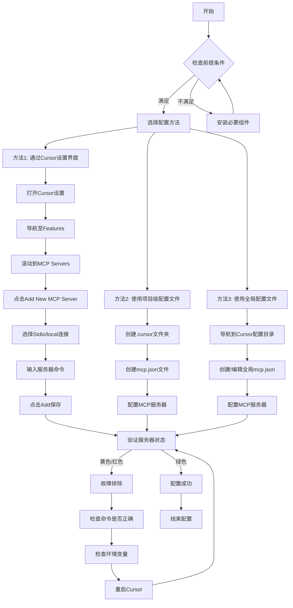
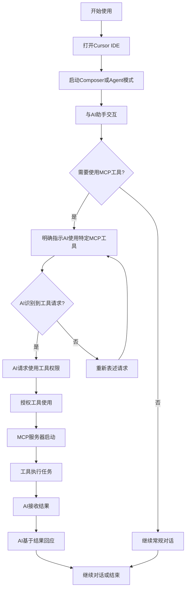
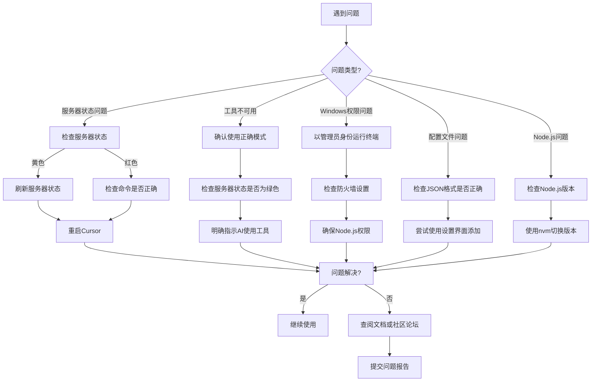
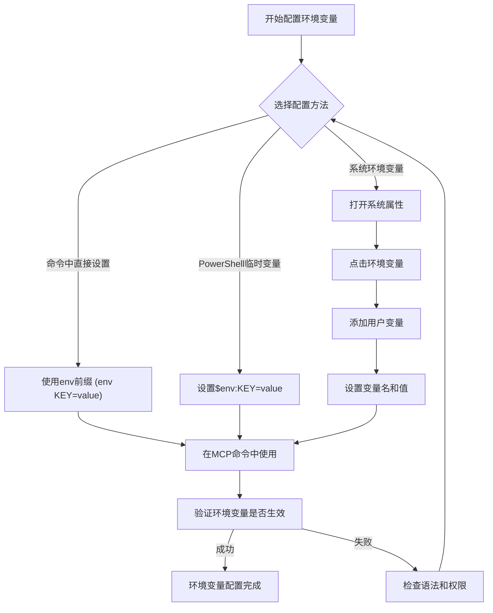
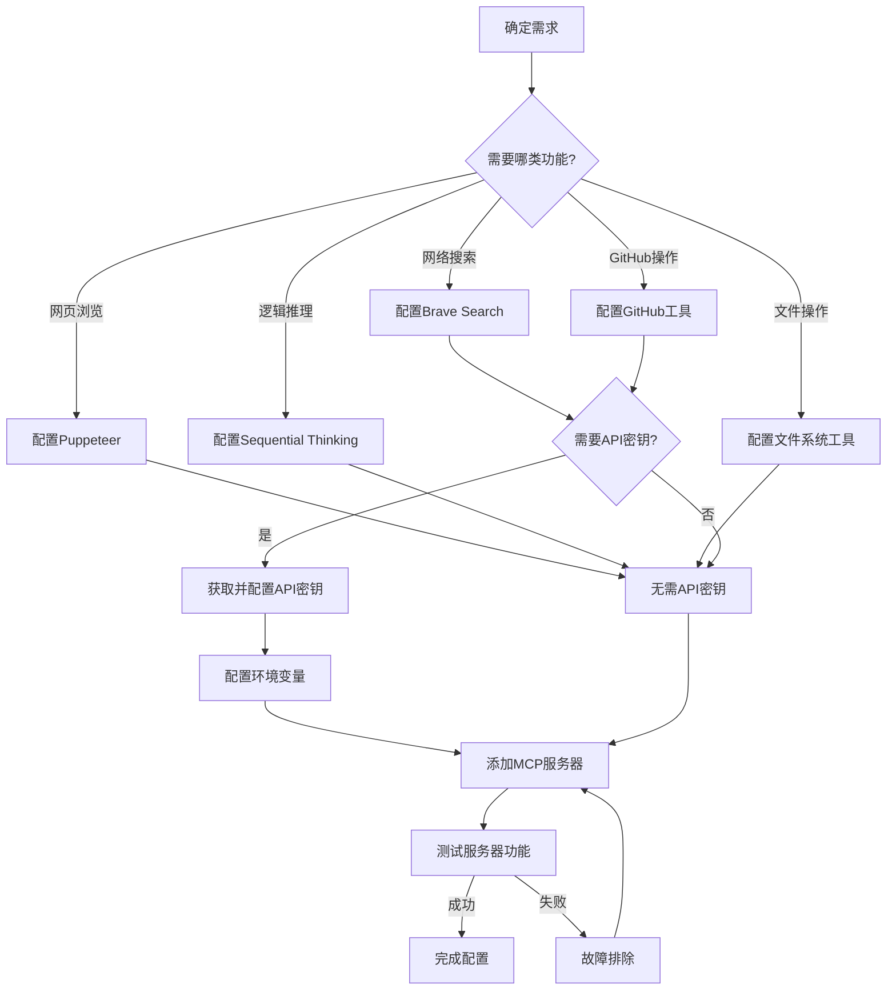

# Cursor MCP Servers 配置与使用流程图

## 配置流程

```mermaid
flowchart TD
    A[开始] --> B{检查前提条件}
    B -->|满足| C[选择配置方法]
    B -->|不满足| D[安装必要组件]
    D --> B
    
    C --> E[方法1: 通过Cursor设置界面]
    C --> F[方法2: 使用项目级配置文件]
    C --> G[方法3: 使用全局配置文件]
    
    E --> H[打开Cursor设置]
    H --> I[导航至Features]
    I --> J[滚动到MCP Servers]
    J --> K[点击Add New MCP Server]
    K --> L[选择Stdio/local连接]
    L --> M[输入服务器命令]
    M --> N[点击Add保存]
    
    F --> O[创建.cursor文件夹]
    O --> P[创建mcp.json文件]
    P --> Q[配置MCP服务器]
    
    G --> R[导航到Cursor配置目录]
    R --> S[创建/编辑全局mcp.json]
    S --> T[配置MCP服务器]
    
    N --> U[验证服务器状态]
    Q --> U
    T --> U
    
    U -->|绿色| V[配置成功]
    U -->|黄色/红色| W[故障排除]
    W --> X[检查命令是否正确]
    X --> Y[检查环境变量]
    Y --> Z[重启Cursor]
    Z --> U
    
    V --> AA[结束配置]
```

## 使用流程

```mermaid
flowchart TD
    A[开始使用] --> B[打开Cursor IDE]
    B --> C[启动Composer或Agent模式]
    C --> D[与AI助手交互]
    D --> E{需要使用MCP工具?}
    
    E -->|是| F[明确指示AI使用特定MCP工具]
    E -->|否| G[继续常规对话]
    
    F --> H{AI识别到工具请求?}
    H -->|是| I[AI请求使用工具权限]
    H -->|否| J[重新表述请求]
    J --> F
    
    I --> K[授权工具使用]
    K --> L[MCP服务器启动]
    L --> M[工具执行任务]
    M --> N[AI接收结果]
    N --> O[AI基于结果回应]
    
    O --> P[继续对话或结束]
    G --> P
```

## 故障排除流程

```mermaid
flowchart TD
    A[遇到问题] --> B{问题类型?}
    
    B -->|服务器状态问题| C[检查服务器状态]
    C -->|黄色| D[刷新服务器状态]
    C -->|红色| E[检查命令是否正确]
    D --> F[重启Cursor]
    E --> F
    
    B -->|工具不可用| G[确认使用正确模式]
    G --> H[检查服务器状态是否为绿色]
    H --> I[明确指示AI使用工具]
    
    B -->|Windows权限问题| J[以管理员身份运行终端]
    J --> K[检查防火墙设置]
    K --> L[确保Node.js权限]
    
    B -->|配置文件问题| M[检查JSON格式是否正确]
    M --> N[尝试使用设置界面添加]
    
    B -->|Node.js问题| O[检查Node.js版本]
    O --> P[使用nvm切换版本]
    
    F --> Q[问题解决?]
    I --> Q
    L --> Q
    N --> Q
    P --> Q
    
    Q -->|是| R[继续使用]
    Q -->|否| S[查阅文档或社区论坛]
    S --> T[提交问题报告]
```

## 环境变量配置流程

```mermaid
flowchart TD
    A[开始配置环境变量] --> B{选择配置方法}
    
    B -->|命令中直接设置| C["使用env前缀 (env KEY=value)"]
    B -->|PowerShell临时变量| D["设置$env:KEY=value"]
    B -->|系统环境变量| E[打开系统属性]
    
    E --> F[点击环境变量]
    F --> G[添加用户变量]
    G --> H[设置变量名和值]
    
    C --> I[在MCP命令中使用]
    D --> I
    H --> I
    
    I --> J[验证环境变量是否生效]
    J -->|成功| K[环境变量配置完成]
    J -->|失败| L[检查语法和权限]
    L --> B
```

## MCP服务器选择流程

```mermaid
flowchart TD
    A[确定需求] --> B{需要哪类功能?}
    
    B -->|网络搜索| C[配置Brave Search]
    B -->|网页浏览| D[配置Puppeteer]
    B -->|逻辑推理| E[配置Sequential Thinking]
    B -->|GitHub操作| F[配置GitHub工具]
    B -->|文件操作| G[配置文件系统工具]
    
    C --> H{需要API密钥?}
    D --> I[无需API密钥]
    E --> I
    F --> H
    G --> I
    
    H -->|是| J[获取并配置API密钥]
    H -->|否| I
    
    J --> K[配置环境变量]
    K --> L[添加MCP服务器]
    I --> L
    
    L --> M[测试服务器功能]
    M -->|成功| N[完成配置]
    M -->|失败| O[故障排除]
    O --> L
```