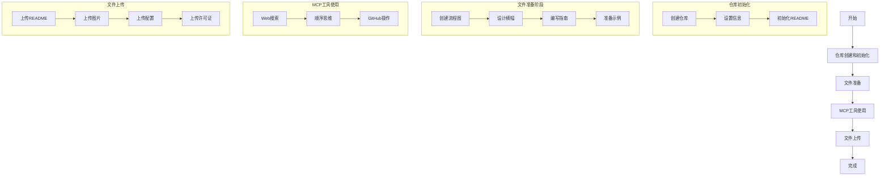

# Cursor MCP Servers 配置工作流程

本文档详细说明了使用Cursor MCP Servers的完整工作流程，包括仓库创建、文件准备、工具使用和文件上传等步骤。

## 工作流程图



## 详细步骤说明

### 1. 仓库创建和初始化
- 使用MCP工具创建新的GitHub仓库
- 设置仓库名称、描述和可见性
- 初始化基本的README.md文件

### 2. 文件准备
- 创建可视化的流程图
- 设计项目的横幅图片
- 编写详细的配置指南
- 准备配置示例文件

### 3. MCP工具使用
- 使用Web搜索工具收集相关信息
- 使用顺序思维工具规划步骤
- 使用GitHub MCP工具进行文件操作

### 4. 文件上传
- 上传README.md主文档
- 上传流程图和图片文件
- 上传配置示例文件
- 上传许可证文件

## 使用说明

1. **克隆仓库**
```bash
git clone https://github.com/Zanedname/cursor-mcp-Servers-0.46-windows-cmd-test.git
```

2. **查看文档**
- 阅读README.md了解基本信息
- 参考flowchart.md查看配置流程
- 查看example-mcp.json获取配置示例

3. **配置过程**
- 按照指南配置环境变量
- 设置MCP服务器
- 测试配置是否生效

## 注意事项

1. 确保使用正确的Cursor版本（0.46）
2. 仔细检查配置文件格式
3. 遵循文档中的最佳实践
4. 如遇问题，参考故障排除指南

## 维护和更新

本工作流程文档会随着项目发展持续更新。如有建议或发现问题，请通过GitHub Issues反馈。